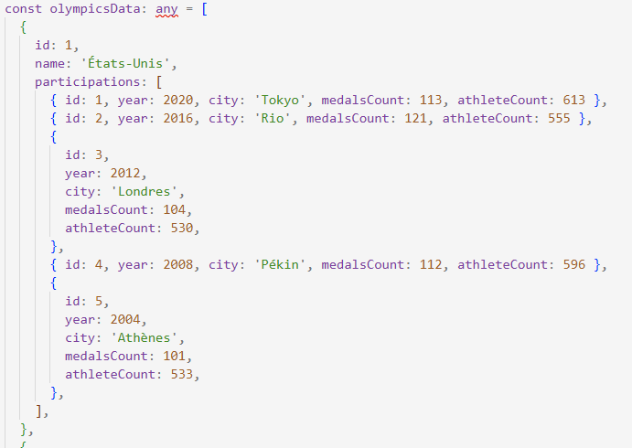
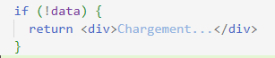

# Telesport

Site web permettant de visualiser l'historique des performances aux Jeux Olympiques selon le pays. 
-En phase de développement-

## Techo stack
- **React 19** 
- **TypeScript** 
- **Vite 5** 
- **Tailwind CSS 4** 
- **React Router 6** 
- **Chart.js** 
- **ESLint** 

## Problèmes actuels et solutions

### Anti-pattern 1
**Problème**
Données codées en dur dans le App.tsx



**Solution proposée**
Créer un dossier mock en attendant de développer l'API back-end

---

### Anti-pattern 2
**Problème**
Incohérence avec le nom du fichier et le composant, const Home dans dossier App.tsx


**Solution proposée**
Créer une convention de nommage, suivre une logique

---

### Anti-pattern 3
**Problème**
Utilisation de `any`, trop large et incompatible avec TypeScript


**Solution proposée**
Typer correctement les données et états

---

### Anti-pattern 4
**Problème**
useEffect avec logique lourde dans le composant

**Solution proposée**
Créer un custom hook

---

### Anti-pattern 5
**Problème**
Présence de multiple console.log()

**Solution proposée**
Les retirer une fois que la phase de développement est terminée

---

### Anti-pattern 6
**Problème**
Logique métier directement dans le composant


**Solution proposée**
Créer une fonction utilitaire dans /utils/

---

### Anti-pattern 7
**Problème**
Logique d'état de chargement basée sur l'absence des données

**Image**


**Solution proposée**
Créer des états loading, errors et !data pour différencier les situations

---

### Anti-pattern 8
**Problème**
Cartes dupliquées dans chartOptions


**Solution proposée**
Créer un composant réutilisable

---

### Anti-pattern 9
**Problème**
Composant avec variable non-utilisée (Country), plusieurs composants dans le même fichier


**Solution proposée**
Séparer dans une autre page, garder en commentaire

---

### Anti-pattern 10
**Problème**
Préparation des données du graphique dans le composant


**Solution proposée**
Extraire dans une fonction pour séparer UI et logique (/utils)

---

### Anti-pattern 11
**Problème**
Présence du routing dans le dossier App.tsx

**Solution proposée**
Mettre dans un fichier à part

---

### Anti-pattern 12
**Problème**
Pas de gestion d'erreur

**Solution proposée**
Ajouter des messages d'erreurs et créer une page 404

---

### Anti-pattern 13
**Problème**
Pas de landmarks clairs


**Solution proposée**
Créer un header, footer, nav et une logique dans les h1, h2, text, etc

---

### Anti-pattern 14
**Problème**
Note de bas de page indique "cliquez sur un pays pour avoir ses détails" alors que pas d'événement au clic


**Solution proposée**
Aligner le texte aux actions possibles, ne pas afficher si actions en cours de développement

## Structures des fichers src/

```
  📁 src/
    📁 components/
      └── Header.tsx (header et nav des pages - dumb)
      └── HeaderChart.tsx (composant header réutilisable pour les charts - dumb)
      └── MedalChart.tsx (graphique des médailles - dumb)
      └── CountryCard.tsx (carte infos des pays - dumb)
      └── Router.tsx (React router pour la naviguation entre les pages - smart)
    📁 hooks/
      └── useData.ts (récupère les données, utilise Axios pour simuler le futur back-end, useState - smart)
    📁 pages/
      ├── Home.tsx (page d'accueil)
      ├── Country.tsx (page contenant les détails pour chaque pays)
      └── Error.tsx (page d'erruer, redirige vers Home.tsx)
    📁 models/
      └── types.ts (définitions des interfaces TypeScript - dumb)
    📁 utils/
      └── olympicsCalculations.ts (calculs reliées au chart, réutilisable - smart)
    📁 mocks/
      └── olympicsMockDatas.ts (données mocks en attendant la back-end)
      
    App.tsx
    main.tsx
    index.css

```


